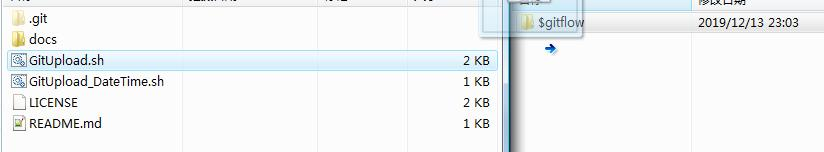

## help-git-updflow-script

It is only a small project to help somebody commit his/hers project faster.

#### Start!

Download this full project and drag the scripts you like in your project root folder.



#### Usage

For Linux / Linux-like users, double-click to open it, or locate to the project folder and type

```bash
sh ./xxx.sh
```

*xxx* refers to the script you want to execute.

#### License

This project is under MIT license.
