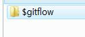
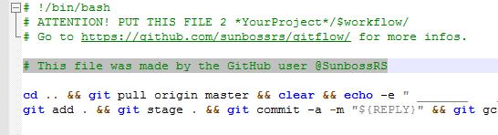
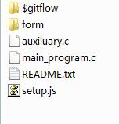
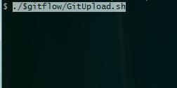

### GitFlow
Thanks for your support!  
Before use this project, make sure:  
- This project is for personal and it is not for business.  
- You cannot use any means to sprout this project without author's agree unless sprouting with *the project link address* and *clone the repository*.  
- When you use this project, means you are agree MIT license.  

---
#### Welcome!
Welcome to use GitFlow! This is a project who can make the work flow of the software *git* more easy.   
This software doesn't need any compiler! You can just use it when you clone this repository down.  
When you copy something in this project, you may need to sign down in the file like "Made by GitHub user @SunbossRS".

#### Start!
First, create a folder named **$gitflow** in your project.  
  
Then, you can just copy the files to your project.  
  
At last, you may need to sign in the file like "Made by GitHub user @SunbossRS".  
  
The last effect is like this!  

#### Use!
You can just use it whatever you are using Windows system or Linux system.  
Start your command line in your project's root directory and input `./$gitflow/*file*.sh`. The* *file*.sh* here refers to the file that you want to run.  
In Windows system, use the *git bash*. In Linux system, use the *bash terminal*.  
